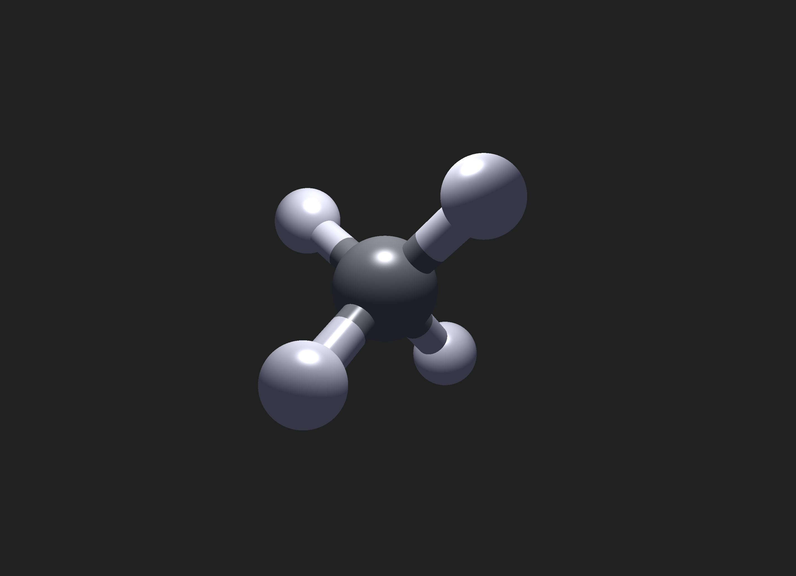

# [MolViz](https://github.com/dirdr/molecular_visualization/edit/main/README.md)

Simple OpenGL molecular visualization, capable of reading protein data bank files using imposter based rendering.
This application has been written for the Scientific visualization course of the MIRI master in the _Facultat d'Informàtica de Barcelona_.

## Features

- Sphere and Cylinders are rendered through imposters.
- Perspective camera
- Zoom
- Shoemake arcball model rotation
- OpenGL instancing for billboards
- Phong shading
- Silhouete
- Dynamic scaling of the molecule
- Halfway bonds coloring

> [!WARNING]
> The program is not capable of deducing the bonds of pdb files without `CONECT` records.

## Usage

You must have rust installed on your computer to start this program, see [rust website](https://www.rust-lang.org/).

A version of OpenGL 4.1 + must also be available.
This application has only been tested on an apple silicon machine with OpenGL 4.1 Metal and GLSL 410 core, althrough it must be possible to run it with more recent versions.

You can either test the program with the provided pdb files (see [pdb folder](./resources/pdb/), or provide your own file.
The files need to be placed inside the pdb folder, see above.

1. Clone the repo
2. Start the application

```sh
cargo run --release -- --file <FILE>
    Options:
  -f, --file <FILE>
  -h, --help         Print help
  -V, --version      Print version
```

## Control

| Control          | Key           |
| ---------------- | ------------- |
| Rotate Molecule  | `Left-Click`  |
| Toggle Silhouete | `Right-Click` |
| Zoom             | `Mouse-Wheel` |

## Showcase




